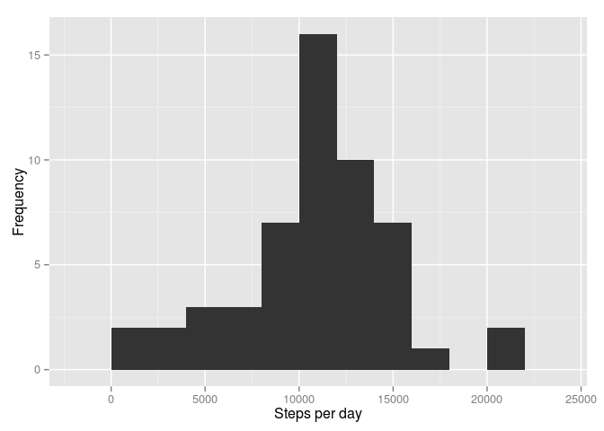
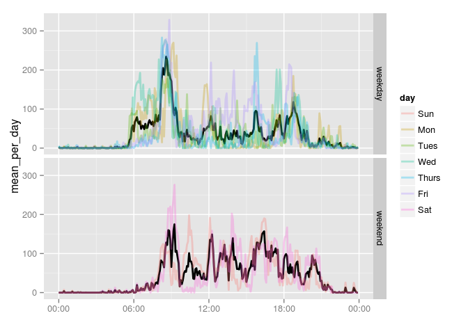

# Reproducible Research: Peer Assessment 1


## Loading and preprocessing the data

```r
library(ggplot2)
library(scales)
library(dplyr)
```

```
## 
## Attaching package: 'dplyr'
## 
## The following object is masked from 'package:stats':
## 
##     filter
## 
## The following objects are masked from 'package:base':
## 
##     intersect, setdiff, setequal, union
```

```r
library(lubridate)
library(knitr)


raw_data <- read.csv("activity.csv")
act_data <- raw_data %>%
                    tbl_df() %>%
                    mutate(date=as.Date(date),
                           day=factor(wday(date,label = TRUE, abbr = TRUE)),
                           weekend=factor(ifelse(day %in% c('Sun','Sat'),'weekend','weekday')),
                           month=factor(month(date,label = TRUE, abbr = TRUE)),
                           interval=parse_date_time(sprintf("%04d", interval),'hM') #convert intervals to time
                           ) 
```


## What is mean total number of steps taken per day?

```r
act_data %>%
  na.exclude() %>%
  group_by(date) %>%
  summarise(day_steps=sum(steps,na.rm=TRUE)) -> day_act
qplot(day_steps,data=day_act, geom='histogram',binwidth=2000)
```

 

```r
mean_per_day <- mean(day_act$day_steps)
median_per_day <- median(day_act$day_steps)
```

The mean total number of steps taken per day was 1.0766189\times 10^{4}. Median was 10765.


## What is the average daily activity pattern?

```r
act_data %>%
  na.exclude() %>%
  group_by(interval) %>%
  summarise(mean=mean(steps)) -> daily_act
p <- ggplot(act_data,aes(interval,steps))
p + geom_smooth()+
    geom_line(aes(interval,mean),data=daily_act,col='red')+
    scale_x_datetime("",labels=date_format("%H:%M"))
```

 

## Imputing missing values

```r
act_data %>%
  group_by(date) %>%
  summarise(na_sum=100* sum(is.na(steps))/n() ) -> nas
  kable(data.frame(table(nas$na_sum)),
        format = "markdown",
        col.names=c("per day NA's proportion,%","Frequency"))
```


|per day NA's proportion,% | Frequency|
|:-------------------------|---------:|
|0                         |        53|
|100                       |         8|

First we looking when NA's values have occured. So we calculate a proportion of NA values for each day. We see in 53, 8,There are 0 whole days of missing data and 8 of partially missing days. Its make values interpolation impossible and the best way is to through them out from data analisis.


```r
act_data<-na.exclude(act_data)
```


## Are there differences in activity patterns between weekdays and weekends?

```r
act_data %>%
  group_by(interval,day) %>%
  summarise(mean_per_day=mean(steps),weekend=weekend[1]) -> per_day_activity

act_data %>%
  group_by(interval,weekend) %>%
  summarise(mean_per_day=mean(steps)) -> day_end_activity

  

p <- ggplot(day_end_activity,aes(interval,mean_per_day))

  p +
    geom_line(aes(interval,mean_per_day),size=2,colour='black')+
    geom_line(aes(interval,mean_per_day,color=day),per_day_activity,size=1,alpha=0.3)+
    facet_grid(weekend~.)+
    scale_x_datetime("",labels=date_format("%H:%M"))
```

 

