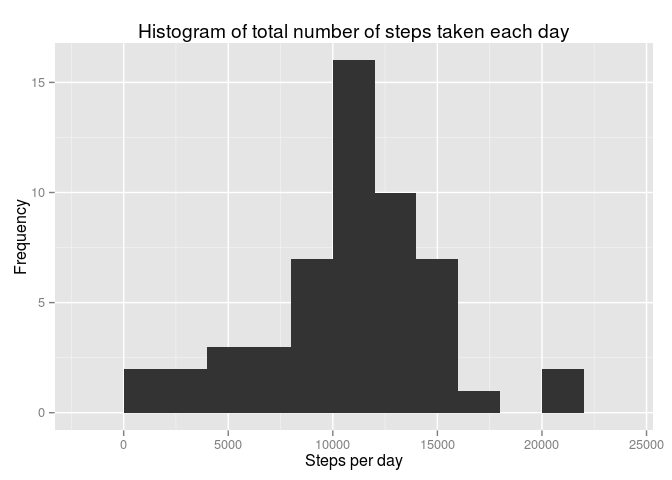
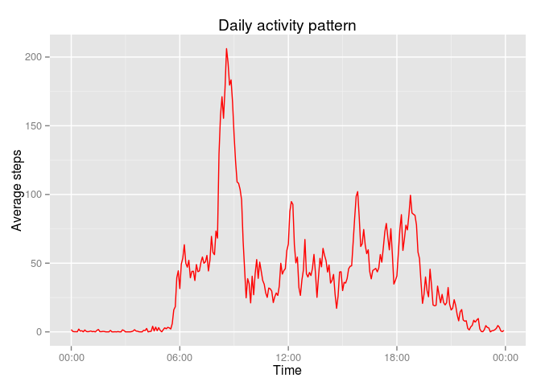

# Reproducible Research: Peer Assessment 1
Denis V. Nesterov  


```r
# numbers >= 10^5 will be denoted in scientific notation, and rounded to 2 digits
options(scipen = 1, digits = 2)
```


## Loading and preprocessing the data

```r
library(ggplot2)
library(scales) # need this to format x labels in ggplot2 as "Hours:Minutes" using ::scale_x_datetime .
library(dplyr)
library(lubridate)
library(knitr)

raw_data <- read.csv("activity.csv")
act_data <- raw_data %>%
                    tbl_df() %>%
                    mutate(date=as.Date(date),
                           interval=parse_date_time(sprintf("%04d", interval),'hM') #convert intervals to time 
                           ) 
```


## What is mean total number of steps taken per day?

```r
act_data %>%
  na.exclude() %>%   # I've exclude NAs here to avoid appearence of zero-activity days if all information about activity in a particular day is missing
  group_by(date) %>%
  summarise(steps = sum(steps)) -> day_act

qplot(steps, data=day_act, 
      geom="histogram",
      binwidth=2000,
      xlab = 'Steps per day',
      ylab = 'Frequency',
      main = 'Histogram of total number of steps taken each day')
```

 

```r
mean_per_day <- mean(day_act$steps)
median_per_day <- median(day_act$steps)
```

The mean of total number of steps taken per day is 10766.19, median is 10765.


## What is the average daily activity pattern?

```r
act_data %>%
  na.exclude() %>%
  group_by(interval) %>%
  summarise(steps_mean=mean(steps)) -> interval_act
p <- ggplot(interval_act,aes(interval,steps_mean))
p + geom_line(col='red')+
    scale_x_datetime(labels=date_format("%H:%M")) +
    ggtitle("Daily activity pattern")+
    xlab('Time')+
    ylab('Average steps')
```

 

```r
with(subset(interval_act, steps_mean==max(steps_mean)[1]), #  There are could be several maximum values. But we see on the plot that anyway, all of them have almost the same time, so we choose the first one to avoid several values in our output
      {
      # <<- used to make 'max_activity_time' & 'max_activity' seen in global.enviroment
      max_activity_time <<- format(interval,'%H:%M') 
      max_activity <<- steps_mean
      }
    )
```

Maximal activity is 206.17 observed at 08:35.

## Imputing missing values
First lets take a look how many of missing values each variable of data set containts.


```r
raw_data %>%
  sapply(function(x) sum(is.na(x)) )%>%
  cbind %>%
  kable(format='markdown',
        col.names = c('Missing values quantity'),
        caption = 'Quantity of missing values in each variable' 
        )
```


|         | Missing values quantity|
|:--------|-----------------------:|
|steps    |                    2304|
|date     |                       0|
|interval |                       0|

In this table we can see that there are 2304 of missing values which contains only in 'steps' variable. 

To devise a strategy for filling of the missing values lets look at their pattern. Actually lets look when NA's values have occured. In table below you can see a poproportion of missing values on one side and number of days with this proportion on the other.


```r
act_data %>%
  group_by(date) %>% 
  summarise(na_prop=100 * sum(is.na(steps)) / n() ) -> nas  #na_prop is a proportion of NAs in each day 
  # calculated as 100*missing values/all values. n() is dplyr:: function which counts number of observations.
  # this code return a data.frame with two columns 'date' and 'na_prop'

  kable(data.frame(table(nas$na_prop)), # 
        format = "markdown",
        col.names=c("missing values proportion,%","Number of days"),
        caption = "Proportion of missing values in each day")
```


|missing values proportion,% | Number of days|
|:---------------------------|--------------:|
|0                           |             53|
|100                         |              8|

There are 8 days of tottaly missed data and 0 of partially missing days. So it is impossible to interpolate missing values on the basis of activity in a day when value was missed. Imputing missed values with 0's and overall average activity can strongly modify day activity pattern. 


```r
threshold_quantile = 0.3
high_activity_interval <- range(subset(interval_act, steps_mean > quantile(steps_mean,threshold_quantile))$interval) %>% format('%H:%M')
```

The mean steps taken during whole day is 37.38. But about 30% of time the mean activity doesn't exceed 4.71. This is a single period which continues from 22:30 to 05:35. Looks like sleeping period. So if missing values will be filled with overall average value, activity of this sleeping period will increase, wich later can be misinterpreted as noctambulism. 

To avoid such pattern damaging problems I'm going to set NAs with "per interval average". 


```r
act_data$steps_filled = act_data$steps # create column for steps with filled NAs

act_data %>%
        filter(is.na(steps)) %>%
        left_join(interval_act, by='interval') %>%   #interval_act is a data_set created in previous chunk, which contains steps averaged over each time interval in 'steps_mean' column.
        select(steps_filled=steps_mean) -> act_data[is.na(act_data$steps),'steps_filled'] 
act_data %>%
  group_by(date) %>%
  summarise(steps = sum(steps), steps_filled=sum(steps_filled) ) -> day_act
```

```r
qplot(steps_filled, data=day_act, 
      geom="histogram",
      binwidth=2000,
      xlab = 'Steps per day',
      ylab = 'Frequency',
      main = 'Histogram of total number of steps taken each day')
```

 


```r
filled_mean <- mean(day_act$steps_filled)
filled_median <- median(day_act$steps_filled)
comparison <- function (v1,v2){
  #function which compare two variables and write results in human readable. `r comparison(13,12)` transfered in '1 higher'
  diff = v1-v2
  if (diff>0){paste(abs(round(diff,2)), 'higher')}
  else if(diff<0){paste(abs(round(diff,2)), 'lower')}
  else if(diff==0){paste('equal')}
   }
```
With inputed missing values mean and median of total day activity are 10766.19 and 10766.19 respectively.
Mean between data with filled missing values is equal to data wich contains missing values. Median after filling of missed values became 1.19 higher.
It is almost no impact of inputting missing values on these estimates of the total daily number of steps.


```r
select(day_act,steps,steps_filled)%>%
  sapply(sd,na.rm=T) -> steps_sd
```
However standard deviation of total daily number of steps became 294.79 lower.

## Are there differences in activity patterns between weekdays and weekends?

```r
act_data %>%
  mutate(weekend= ifelse(wday(date,label=T,abbr=T) %in% c('Sun','Sat'), 'Weekend','Weekday' ),
         weekend=factor(weekend)) %>%
  group_by(interval,weekend) %>%
  summarise(mean_per_int=mean(steps_filled)) -> day_end_activity

p <- ggplot(day_end_activity,aes(interval,mean_per_int))
p +
  geom_line(size=1,colour='black')+
  facet_grid(weekend~.)+
  ggtitle("Daily activity pattern")+
  xlab('Time')+
  ylab('Average steps')+
  scale_x_datetime(labels=date_format("%H:%M"))
```

 
